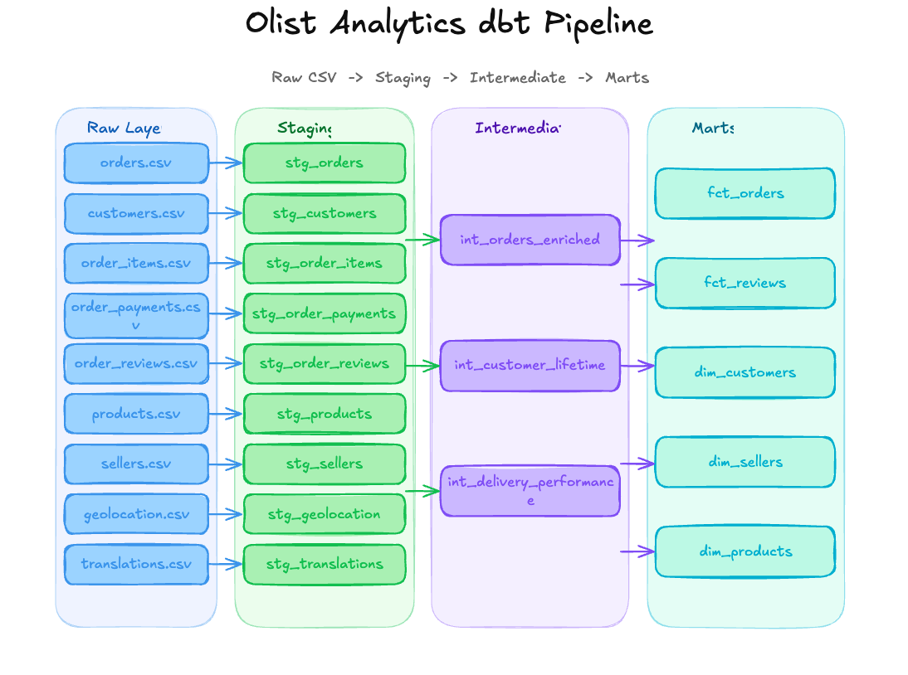

# Olist Analytics dbt Pipeline

An end-to-end dbt project transforming raw Brazilian e-commerce data from 
[Olist](https://www.kaggle.com/datasets/olistbr/brazilian-ecommerce) into 
clean, tested, business-ready analytics models.

## Overview

This project takes 9 raw CSV files from the Olist dataset — covering 100,000 
orders placed between 2016 and 2018 across multiple Brazilian marketplaces — 
and transforms them through a layered dbt pipeline into mart models that answer 
real business questions about orders, customers, sellers and products.

## Tech Stack

- **Database**: PostgreSQL 17 (local)
- **Transformation**: dbt Core 1.11.8
- **Adapter**: dbt-postgres 1.10.0
- **Version Control**: Git / GitHub

## Project Structure
models/
├── staging/          # 9 models — one per source table, renamed and cast
├── intermediate/     # 3 models — joins, aggregations, business logic
└── marts/            # 5 models — business-facing fact and dimension tables
## Pipeline Layers

### Staging
One model per source table. Responsibilities:
- Rename columns to consistent snake_case
- Cast all columns from TEXT to appropriate data types
- No joins, no business logic

### Intermediate
Hidden from business users. Responsibilities:
- Join staging models together
- Aggregate line-item data to order level
- Calculate derived metrics like delivery time

| Model | Description |
|---|---|
| `int_orders_enriched` | Orders joined with customers, items and payments |
| `int_customer_lifetime` | Order history aggregated per customer |
| `int_delivery_performance` | Delivery time calculations per order |

### Marts
Business-facing tables. Materialised as tables for query performance.

| Model | Description |
|---|---|
| `fct_orders` | One row per order with all key metrics |
| `fct_reviews` | One row per review joined with order context |
| `dim_customers` | One row per customer with lifetime value metrics |
| `dim_sellers` | One row per seller with revenue metrics |
| `dim_products` | One row per product with sales metrics |

## Getting Started

### Prerequisites
- PostgreSQL 17
- Python 3.11 or 3.12
- dbt-core 

### Setup

1. Clone the repo
```bash
git clone https://github.com/LukeOpany/dbt-olist-pipeline
cd olist-analytics-dbt
```

2. Create and activate a virtual environment
```bash
python3.11 -m venv venv
source venv/bin/activate
```

3. Install dbt
```bash
pip install dbt-core dbt-postgres
```

4. Configure your profile at `~/.dbt/profiles.yml`
```yaml
dbt_olist:
  target: dev
  outputs:
    dev:
      type: postgres
      host: localhost
      port: 5432
      user: your_username
      password: your_password
      dbname: olist
      schema: analytics_dev
      threads: 4
```

5. Load the raw Olist CSVs into Postgres under the `raw` schema

6. Run the pipeline
```bash
dbt run
```

7. Run tests
```bash
dbt test
```

8. Generate and serve documentation
```bash
dbt docs generate && dbt docs serve
```

## Data Sources

Raw data loaded into `olist.raw` schema via PostgreSQL `COPY` command:

| Table | Rows | Description |
|---|---|---|
| orders | ~99k | Core order records |
| customers | ~99k | Customer details and location |
| order_items | ~112k | Line items per order |
| order_payments | ~103k | Payment details per order |
| order_reviews | ~99k | Customer review scores and comments |
| products | ~33k | Product catalogue |
| sellers | ~3k | Seller details and location |
| geolocation | ~1M | Zip code to lat/lng mapping |
| product_category_name_translation | 71 | Portuguese to English category names |

## Testing

Tests are applied across all three layers using dbt's built-in test types:
- `unique` — primary keys have no duplicates
- `not_null` — required columns are always populated
- `accepted_values` — status and score columns contain only valid values

```bash
dbt test                        # run all tests
dbt test --select staging       # run staging tests only
dbt test --select marts         # run mart tests only
```