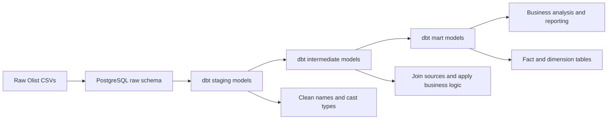
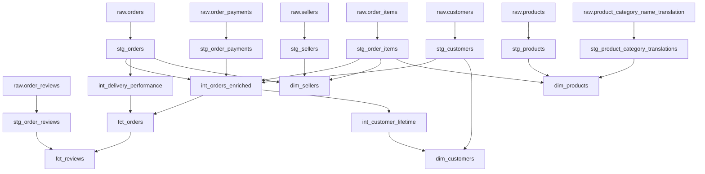

# Olist Analytics dbt Pipeline

An end-to-end analytics engineering project that transforms raw Brazilian e-commerce data from [Olist](https://www.kaggle.com/datasets/olistbr/brazilian-ecommerce) into clean, tested, business-ready dbt models.

This project demonstrates a modern data engineering workflow: raw source ingestion, staging cleanup, intermediate business logic, mart modeling, and data quality validation.

## Project Summary

The pipeline starts with 9 raw CSV files from the Olist dataset, covering roughly 100,000 orders placed between 2016 and 2018 across Brazilian marketplaces. The raw data is loaded into PostgreSQL under a `raw` schema, then transformed with dbt into reusable staging models, intermediate models, and final mart tables.

The final marts support business questions about order performance, customer value, seller revenue, product sales, delivery reliability, and customer review patterns.

## Tech Stack

- **Database:** PostgreSQL 17
- **Transformation:** dbt Core 1.11.8
- **Adapter:** dbt-postgres 1.10.0
- **Language:** SQL
- **Version Control:** Git / GitHub

## Architecture



## Data Lineage



## Project Structure

```text
models/
|-- staging/          # 9 source-aligned models: renamed, cleaned, and cast
|-- intermediate/     # 3 models: joins, aggregations, and reusable business logic
`-- marts/            # 5 business-facing fact and dimension tables
```

## Pipeline Layers

### Staging

One model per source table. This layer keeps transformations close to the raw source.

- Renames columns into consistent `snake_case`
- Casts raw fields into useful data types
- Applies light cleanup without joins or business logic
- Adds dbt tests for keys, required fields, and accepted values

### Intermediate

Reusable transformation layer hidden from business users.

| Model | Description |
|---|---|
| `int_orders_enriched` | Orders joined with customers, items, and payments |
| `int_customer_lifetime` | Customer order history aggregated to customer level |
| `int_delivery_performance` | Delivery speed and early/late delivery calculations |

### Marts

Business-facing tables materialized for analysis and reporting.

| Model | Grain | Description |
|---|---|---|
| `fct_orders` | One row per order | Order status, customer location, payment totals, item totals, and delivery metrics |
| `fct_reviews` | One row per review | Review score and comments joined with order context |
| `dim_customers` | One row per unique customer | Customer location, lifetime value, order count, and purchase history |
| `dim_sellers` | One row per seller | Seller revenue, item volume, freight value, and order count |
| `dim_products` | One row per product | Product category, translated category name, sales totals, and product attributes |

## Business Questions Answered

This project turns raw marketplace tables into marts that can answer practical business questions such as:

- Which customer states generate the most revenue and orders?
- Which sellers drive the most delivered-order revenue?
- Which product categories sell the most units and generate the most revenue?
- How long do orders take to reach the carrier and customer?
- Which orders arrive early or late compared with estimated delivery dates?
- How do review scores relate to delivery speed and order value?
- Which customers have the highest lifetime value and repeat-order activity?

## Example Analysis Query

Example query against the final marts: monthly revenue, order volume, and average delivery performance by customer state.

```sql
select
    date_trunc('month', ordered_at) as order_month,
    customer_state,
    count(*) as total_orders,
    round(sum(total_payment_value), 2) as total_revenue,
    round(avg(days_to_deliver), 2) as avg_days_to_deliver,
    round(avg(days_early_or_late), 2) as avg_days_early_or_late
from analytics_dev.fct_orders
where order_status = 'delivered'
group by 1, 2
order by order_month, total_revenue desc;
```

This is the purpose of the mart layer: analysts can work from clean business entities instead of repeatedly joining raw CSV-shaped tables.

## Data Sources

Raw data loaded into the `olist.raw` schema via PostgreSQL `COPY` command.

| Table | Approx. rows | Description |
|---|---:|---|
| `orders` | 99k | Core order records |
| `customers` | 99k | Customer details and location |
| `order_items` | 112k | Line items per order |
| `order_payments` | 103k | Payment details per order |
| `order_reviews` | 99k | Customer review scores and comments |
| `products` | 33k | Product catalog |
| `sellers` | 3k | Seller details and location |
| `geolocation` | 1M | Zip code to latitude/longitude mapping |
| `product_category_name_translation` | 71 | Portuguese-to-English category names |

## Data Quality Testing

The project uses dbt's built-in tests to validate key assumptions across the pipeline.

| Test type | Purpose | Example |
|---|---|---|
| `unique` | Primary keys do not duplicate | `stg_orders.order_id`, `stg_customers.customer_id`, `stg_products.product_id` |
| `not_null` | Required fields are populated | order IDs, customer IDs, product IDs, review IDs |
| `accepted_values` | Categorical values stay inside valid ranges | `stg_order_reviews.review_score` in `1` through `5` |

Run the validation suite:

```bash
dbt test
```

Useful targeted runs:

```bash
dbt test --select staging
dbt test --select marts
dbt test --select stg_order_reviews
```

Example expected output shape after a successful run:

```text
Completed successfully

Done. PASS=... WARN=0 ERROR=0 SKIP=0 TOTAL=...
```

## Getting Started

### Prerequisites

- PostgreSQL 17
- Python 3.11 or 3.12
- dbt Core
- dbt-postgres

### Setup

1. Clone the repo.

```bash
git clone https://github.com/LukeOpany/dbt-olist-pipeline.git
cd dbt-olist-pipeline
```

2. Create and activate a virtual environment.

```bash
python3.11 -m venv venv
source venv/bin/activate
```

3. Install dbt.

```bash
pip install dbt-core dbt-postgres
```

4. Configure your profile at `~/.dbt/profiles.yml`.

```yaml
dbt_olist:
  target: dev
  outputs:
    dev:
      type: postgres
      host: localhost
      port: 5432
      user: your_username
      password: your_password
      dbname: olist
      schema: analytics_dev
      threads: 4
```

5. Load the raw Olist CSVs into PostgreSQL under the `raw` schema.

6. Check the dbt connection.

```bash
dbt debug
```

7. Run the pipeline.

```bash
dbt run
```

8. Run tests.

```bash
dbt test
```

9. Generate and serve dbt documentation.

```bash
dbt docs generate
dbt docs serve
```

## What This Demonstrates

- Designing a layered dbt project from raw files to business-ready marts
- Building fact and dimension models around clear business grains
- Using intermediate models to keep joins and aggregations reusable
- Adding dbt tests for data quality and trustworthy downstream analysis
- Writing SQL models that support revenue, delivery, product, seller, customer, and review analysis

## Production Improvements

If this project were moved from local development toward production, the next improvements would be:

- **Orchestration:** schedule ingestion, `dbt run`, and `dbt test` with Airflow, Dagster, or GitHub Actions
- **CI checks:** run dbt parse/build/test on pull requests before merging model changes
- **Warehouse deployment:** move from local PostgreSQL to a cloud warehouse such as BigQuery, Snowflake, or Redshift
- **Incremental models:** convert large fact tables to incremental materializations where appropriate
- **Data freshness checks:** add source freshness tests for raw ingestion tables
- **Documentation hosting:** publish dbt docs so lineage and model definitions are easy to review
- **Dashboard layer:** connect marts to a BI tool for revenue, delivery, seller, product, and customer reporting
